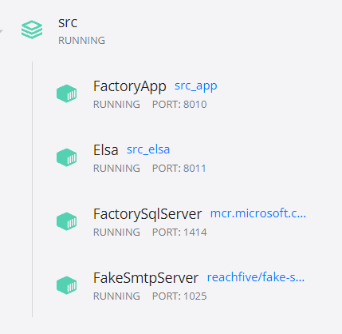
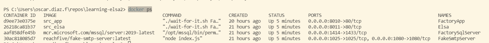
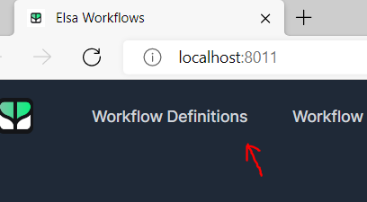
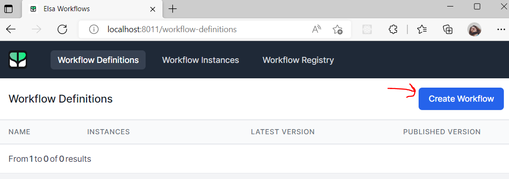
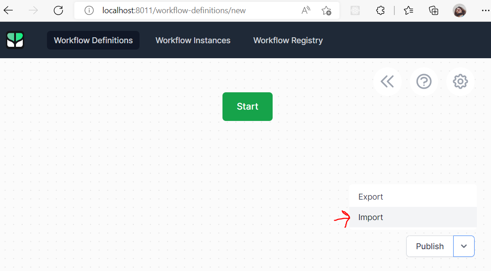
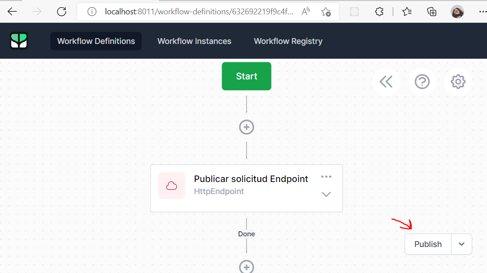
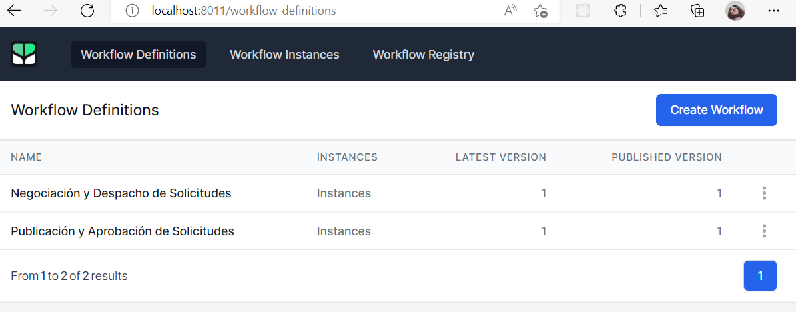

## Tabla de contenido

- [Descripción](#descripción)
- [Contenido](#contenido)
  - [postman](#postman)
  - [scripts](#scripts)
  - [showing](#showing)
  - [src](#src)
  - [workflows](#workflows)
- [Ejecutar](#ejecutar)
  - [Primera ejecución](#primera-ejecución)
    - [Datos iniciales](#datos-iniciales)
    - [Importar flujos de trabajo](#importar-flujos-de-trabajo)
- [Links de interés](#links-de-interés)

# Descripción

En este respositorio se experimenta integrando una aplicación Web a flujos de trabajo de ELSA con el fin de realizar la transición de estados de una solicitud de materias primas como parte de una prueba de concepto.


> Imagen de referencia

# Contenido

El repositorio contiene las siguientes carpetas:

## postman

En esta [carpeta](postman) se encuentran colecciones de Postman que sirven de ayuda para realizar el llamado de algunos Enpoint tanto de la API de la aplicación de la fábrica como de ELSA Workflow.

## scripts

En esta [carpeta](scripts) se encuentran scripts de SQL que serán necesarios ejecutar la primera vez que se levante el contenedor de Docker para SQL Server.

## showing

En esta [carpeta](showing) se encuentran una imagen de referencia que he utilizado para la presentación de esta prueba de concepto. Además otras imágenes que usan en este README.

## src

En esta [carpeta](src) se encuentra el código fuente para la realización de esta prueba de concepto, a continuación una explicación de cada uno de los archivos y carpetas que la componen:

- [ElsaDashboardAndServer](src/ElsaDashboardAndServer):
Proyecto de ASP.NET Core en su versión 5.0, usa los paquetes necesarios para integrar el framework [ELSA Workflow](https://elsa-workflows.github.io/elsa-core/) junto con su propio Dashboard para poder gestionar cómodamente los flujos de trabajo.

- [FactoryApp](src/FactoryApp):
Proyecto de ASP.NET Core en su versión 5.0, contiene una aplicación hecha en ReactJS en su versión 16 ubicada en [ClientApp](src/FactoryApp/ClientApp), juntos conforman la aplicación Web que, para este ejemplo, una fábrica usa para gestionar las materias primas.

- [docker-compose.yml](src/docker-compose.yml):
Archivo que permite orquestar el despliegue de cada uno de los contenedore de Docker que conforman la prueba de concepto.

- [LearningElsa.sln](src/LearningElsa.sln):
Solución de Visual Studio que permite trabajar cómodamente desde el IDE.

## workflows

En esta [carpeta](workflows) se encuentran los flujos de trabajo que se deben importar por primera vez en ELSA Worflow una vez esté levantado el contenedor de Docker. Los flujos a importar son:

- [publicar-solicitud.json](workflows\publicar-solicitud.json) Flujo de trabajo para llevar a cabo la publicación y aprobación de una solicitud de materias primas.
- [negociar-solicitud.json](workflows/negociar-solicitud.json) Flujo de trabajo para llevar a cabo la negociación, despacho y completado de una solicitud de materias primas.

> Los demás archivos en esta carpeta son ocasionales para probar comportamientos en los flujos.

# Ejecutar

> La información acontinuación asume que se esta usando un host Windows con docker-compose.

Para poder ejecutar la prueba de concepto primero se debe crear una red de Docker llamada *elsa-net*, esto lo podemos hacer ejecutando el siguiente comando:

```
docker network create elsa-net
```

Luego debemos levantar las instancias de Docker haciendo uso del archivo de docker-compose para que sea mucho más sencillo, para hacer esto ejecutamos el siguiente comando:

```
docker-compose -f ./src/docker-compose.yml up -d --build
```

Al finalizar la ejecución podrás visualizar los diferentes contenedores en Docker Desktop:



O ejecutando el siguiente comando:

```
docker ps
```



Como te puedes dar cuenta los contenedores estarían disponbiles así:

- Aplicación Web de la fábrica: Navengando a http://localhost:8010
- Servidor y Dashboard de ELSA Workflow: Navegando a http://localhost:8011
- Servidor de SQL Server: Disponible en *localhost* usando el puerto **1414**
- Servidor SMTP: Captura correos electrónicos enviados desde ELSA, puedes revisar los correos navegando a http://localhost:1080

## Primera ejecución

Los siguientes pasos los debes realizar sólo la primera vez que ejecutes la prueba de concepto, es decir, una vez hayas terminado de levantar los contenedores de Docker con el docker-compose.

### Datos iniciales

La base de datos de la aplicación de la fábrica en este momento se encuentra sin datos, para llenarla con datos iniciales puedes usar el script ubicado en el archivo [create-initial-data.sql](scripts/create-initial-data.sql).

### Importar flujos de trabajo

Actualmente ELSA se encuentra sin flujos de trabajo, se deben importar los flujos [publicar-solicitud.json](workflows\publicar-solicitud.json) y [negociar-solicitud.json](workflows/negociar-solicitud.json) para hacer esto haz lo siguiente:

1. Navega a http://localhost:8011 y :
2. Presiona el menú *Workflow Definitions*.



3. Presiona el botón *Create Worflow*.


4. Presiona el botón *Import*.


5. Escoge el archivo [publicar-solicitud.json](workflows\publicar-solicitud.json) y haz click en *Publish*.


6. Repide los pasos 1-5, pero importando el archivo [negociar-solicitud.json](workflows/negociar-solicitud.json).

Finalmente debes ver lo siguiente desde el menú *Workflow Definitions*.


# Links de interés

- [ELSA Workflow](https://elsa-workflows.github.io/elsa-core/) Página oficial de ELSA Workflow.
- [docker network create](https://docs.docker.com/engine/reference/commandline/network_create/) Documentación acerca de cómo crear una red de docker.
- [Dockerizing React App With .NET Core Backend](https://medium.com/bb-tutorials-and-thoughts/dockerizing-react-app-with-net-core-backend-f02767dd9415) Información acerca de cómo Dockerizar una aplicación de React junto con ASP.NET Core.